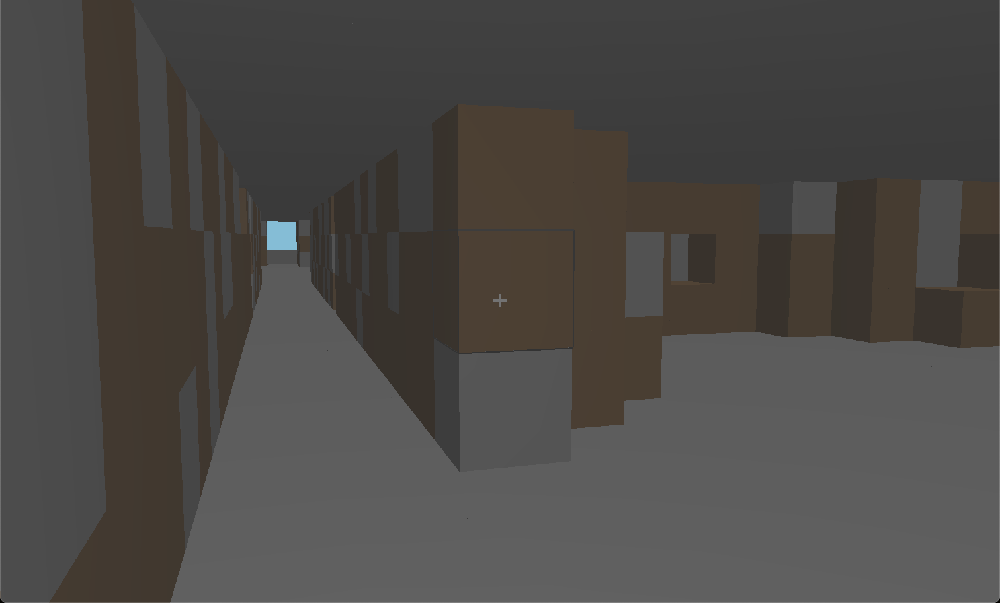

# C "Minecraft Clone"

For some value of "Minecraft Clone". Updated in late 2023!

This was a university project back in 2010/2011 which I really enjoyed -- build a minecraft-like world of cubes with OpenGL, including first person mouselook+wasd controls, digging, mobs, perlin-noise caves, clouds, and hills, a day/night system, and networked players. At the time I got to a place where, well... I think I passed.

Over the years I'd come back to it every once in a while and wince at the atrocious mess of code. I got it running a few times and noticed how slow and buggy and insane it was -- no textures, the lighting jumps all over, digging seemed completely non-operational, and it was so *slow*. I could start a server and a client, and the client would get the world from the server, but the two players wouldn't see each other in there. And the only time I ever saw the mobs (monster objects, which are supposed to wander around in the caves) was when I hit rendering issues allowing me to see through the world.

So I've recently (December 2023ish) picked this back up with a bit of a resolution to fix it and see where I can take it. I'd like to learn more about modern OpenGL, play with a networking sandbox from an interesting working start, and try to make this old turd shine.

## To install / run

### Windows

- I have no idea how to make this work on windows. Sorry! It'd take something like: get the code, and then you'll likely want to use mingw-w64 or something, and write your own makefile pieces in `makefile` and `src/makefile` which point to an installed opengl library and include files, which may need to be some very old crazy versions, like 2.1. I'm not sure if more modern ones let you call old functions this project used.

### OSX

- get the code and run `make osx`. You may need to mess with the OpenGL Framework directory in src/makefile, but a compatible (read: ancient) OpenGL and GLUT *should* be installed already. You might need to install xcode's dev tools to run make/gcc etc, which is way outside the scope of this paragraph.
- this project has been run in 2023 on an m1 laptop, under sonoma 14.1

### Linux

- get the code and run `make ubuntu`. You'll likely need to have opengl development libraries and other build tools installed, and might need to change where the libs/includes are pointed at. You might hit problems with opengl versions.
- I haven't run this on linux in a decade, so it may be hairier than that.

## Project State

### Todos

- refactor out most of the global state into passed context objects
- possibly port to C++ for the sake of adding classes
- try to make it run on other systems than my mac
- sane-ify initialization order for the sake of networking (e.g. clients should request their identity from the server before initializing most of the world)
- enable networked players to see each other and fill out network protocol
- better network error handling (like server quits)
- more sophisticated movement physics to reduce choppy motion feeling
- "placing cubes"
- possibly an inventory / menu
- timer-based cube removal to increase mincraft-feels
- textures (maybe waiting for a move to modern opengl)
- rewrite opengl code to use 3.3+-style shaders and functions, rather than the 2.1-style fixed function pipeline this project was originally built in
- chunks for bigger maps? threading?

### v0.03 - 2023ish

- finally implemented digging properly, including a screenspace crosshair and mouselook-driven cube highlights so you can see what cube you're going to remove with confidence
- restored working culling, improving framerate from 15ish fps up to 50-70ish
- mitigated most lighting glitches which would occur while player simply stood still looked around
- smaller lighting improvements: colour, levels, self-emission all moved to values I personally found more pleasing
- increased player movement speed
- fixed mouselook initialization issue where first motion would throw player angle to a random place
- reformatted codebase with some AStyle rules to bring consistency to it

### v0.02 - 2019ish

basically no changes; just got it running again and fixed a small bug or two.

### v0.01 - 2011ish

At present, things compile and run and the worlds sync - players aren't quite there yet, clouds and the sun are kind of dodgy (the sun is sometimes synced), and mobs could be doing anything and I wouldn't know. But they look good by the numbers.

Committing because the worlds manage to transmit.

### v0.00 - 2011ish

commits lost to time (I likely wasn't using git very actively while working on the project)

### Notes (as of 2023)

Due to rampant horrors, the code in this project has been formatted using Artistic Style (https://astyle.sourceforge.net/astyle.html), specifically via the Sublime plugin. The extra options defined are:

"options_default": {
  "style": "1tbs",
  "indent": "spaces",
  "indent-spaces": 2,
  "unpad-paren": true,
  "pad-header": true,
  "squeeze-ws": true,
  "squeeze-lines": 2,
  "break-blocks": "default"
}

As of December 2023, getting Artistic Style's sublime plugin to run on an m1 mac required this process: https://github.com/timonwong/SublimeAStyleFormatter/issues/95#issue-1055594547

And getting openGL to link on osx required finding the location of the linkable Frameworks with `.xcrun --sdk macosx --show-sdk-path`

## Questions, etc

Find a path to my attention and I'd be very happy to chat about this project.

## License

All code here, with the exception of Ken Perlin's noise-related code, which is vital to this project, is public domain. Use it in any way, with or without my permission. If you do use it, I'd love to hear about it! I make no claims of the usefulness or fitness of any code here for any purposes.

Ken Perlin's code is of questionable provenance... the website I found it on no longer responds to DNS entries, so ... choose your own adventure there.

